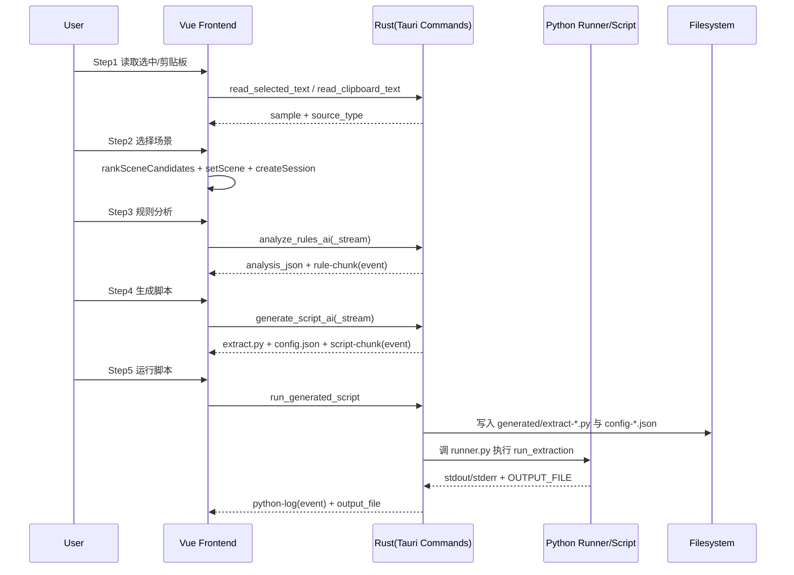
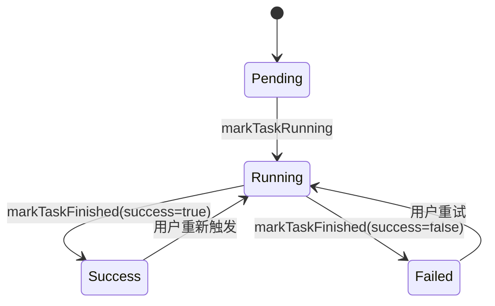

# 专家评审版《需求说明书 + 现状问题诊断》

更新日期：2026-04-21  
项目路径：`D:\aiprd-jiaoben`  
文档定位：问题导向需求书（面向专家评审）

---

## 1. 项目背景与目标边界

### 1.1 产品目标（严格 5 步）
本工具仅围绕“样本文本驱动”完成以下 5 件事：
1. 获取鼠标选中或剪贴板中的样本文本。
2. 基于样本选择业务场景。
3. 基于“样本 + 场景 + 模板 + 大模型”生成结构化规则分析 JSON。
4. 基于“规则分析 + 场景 schema + Python 脚手架 + 大模型”生成 `extract.py` 与 `config.json`。
5. 运行脚本并输出结构化结果（`xlsx/csv/json/md`）。

### 1.2 明确非目标
1. 不引入“页面 0”。
2. 不做“前置治理平台 / PDF 清洗平台 / 两阶段执行引擎”。
3. 不以 clean JSON、table_group、image manifest 作为主输入。
4. 运行阶段不把 AI 当唯一判定器。

### 1.3 当前路由边界
1. 主流程固定路由：`/step/1` 到 `/step/5`。
2. 管理页面：`/sessions`（会话记录）、`/scenes`（场景管理）。
3. 主流程仍然是五步，管理页为旁路管理能力，不新增业务步骤。

---

## 2. 角色与使用场景

### 2.1 角色定义
1. 操作者：完成 5 步流程，生成并运行抽取脚本。
2. 专家评审者：审查场景模板、规则 JSON、脚本质量、误抽率与稳定性。
3. 管理员：维护 LLM API 配置、场景模板和会话记录。

### 2.2 典型使用场景
1. 从维修手册中抽取故障症状表、诊断流程、警告提示等结构化数据。
2. 通过会话回放复现某次抽取过程并定位问题环节。
3. 在线调整场景模板与提示词后复跑脚本，验证误抽是否下降。

---

## 3. 系统全景（实现事实）

### 3.1 技术架构
1. 前端：Vue 3 + TypeScript + Pinia + Vue Router。
2. 桌面端：Tauri 2 + Rust Command。
3. 执行端：Python 脚手架 + 运行器。
4. 模板：本地 JSON（`src/config/scene-templates/*.json`）。
5. AI 调用：仅用于 Step3（规则分析）和 Step4（脚本适配生成）。

### 3.2 核心运行边界
1. Tauri 命令负责系统能力（读取选中、剪贴板、文件对话框、运行 Python、流式事件）。
2. Python 负责多格式读取与规则抽取执行。
3. 前端负责状态机、步骤门禁、会话跟踪和提示词编辑。

### 3.3 主流程时序图（Step1→Step5）


---

## 4. 五步操作旅程（操作逻辑与环节过程）

## Step1 输入源获取
| 项目 | 内容 |
|---|---|
| 前置条件 | 应用启动，处于 `/step/1` |
| 用户操作 | 读取选中内容 / 使用剪贴板 / 清空样本 / 下一步 |
| 系统动作 | 调用 `read_selected_text`；失败回退 `read_clipboard_text`；更新 `sample` |
| 输出 | `sample.selected_text`、`sample.source_type` |
| 状态迁移 | 有效样本后 `step1=done`, `step2=current` |
| 异常分支 | 两者都失败时提示“请先复制内容”；样本空禁止下一步 |

## Step2 场景选择
| 项目 | 内容 |
|---|---|
| 前置条件 | `step1=done` |
| 用户操作 | 智能推荐场景 / 人工选择一级场景与子场景 / 下一步 |
| 系统动作 | `rankSceneCandidates` 计算候选；`setScene`；`createSessionByScene` |
| 输出 | `scene.primary_scene`、`scene.sub_scene`；创建会话记录 |
| 状态迁移 | `step2=done`, `step3=current`；下游结果失效 |
| 异常分支 | 子场景必选时未选则禁用下一步 |

## Step3 规则分析
| 项目 | 内容 |
|---|---|
| 前置条件 | `step2=done` 且样本非空且场景模板存在 |
| 用户操作 | 生成规则分析 / 重新分析 / 流式分析 / 编辑提示词 / 人工调整映射 |
| 系统动作 | 调 `analyze_rules_ai` 或 `analyze_rules_ai_stream`；监听 `rule-chunk` |
| 输出 | `rule.analysis_json`（结构化）+ `analysis_basis` |
| 状态迁移 | 成功后 `step3=done`；重分析触发 `step4=stale`, `step5=pending` |
| 异常分支 | 缺模板、缺样本、命令失败、JSON 解析失败 |

## Step4 脚本输出
| 项目 | 内容 |
|---|---|
| 前置条件 | `rule.analysis_json` 有效 |
| 用户操作 | 生成脚本 / 重新生成 / 复制脚本 / 下载脚本与配置 / 编辑提示词 |
| 系统动作 | 调 `generate_script_ai_stream`（含 `run_id`）；监听 `script-chunk` |
| 输出 | `script.extract_py`、`script.config_json` |
| 状态迁移 | 成功后 `step4=done`；重新生成触发 `step5=stale` |
| 异常分支 | 参数契约不匹配、模板 schema 异常、LLM 返回异常 |

## Step5 运行结果
| 项目 | 内容 |
|---|---|
| 前置条件 | 已生成 `extract.py` 和 `config.json` |
| 用户操作 | 选择输入文件/目录、选择输出目录、选择格式、运行脚本 |
| 系统动作 | 调 `run_generated_script`；Rust 写入临时脚本并启动 `runner.py`；实时推送 `python-log` |
| 输出 | `runResult.output_file`、日志流、退出码 |
| 状态迁移 | 成功后 `step5=done` |
| 异常分支 | Python 启动失败、脚本异常、路径无效、输出为空 |

---

## 5. 状态机与步骤门禁规则

### 5.1 全局状态（实现）
系统使用统一 `WorkflowState` 管理关键对象：
1. `sample`：`selected_text`、`source_type`
2. `scene`：`primary_scene`、`sub_scene`
3. `rule`：`analysis_json`、`confirmed`
4. `script`：`extract_py`、`config_json`、`generated`
5. `runConfig`：`input_path`、`output_dir`、`output_format`
6. `stepStatus`：`step1~step5`（`pending/current/done/stale`）
7. `sessions`：会话快照与事件流
8. `taskStatus`：`rule_analysis/script_generation/script_run/api_test`

### 5.2 门禁规则
1. 路由守卫：进入第 N 步前必须保证前 N-1 步均为 `done`。
2. 已完成步骤可回退；未完成步骤不可点击。
3. Step3 重分析会使 Step4/5 进入失效状态。
4. Step4 重生成会使 Step5 进入失效状态。

### 5.3 异步任务跨页不中断
任务状态在全局 `taskStatus` 保存，非组件局部状态。页面切换后：
1. 任务继续执行（Rust/Promise 仍在进行）。
2. 日志和状态继续更新全局 store。
3. 返回原页面可看到最新结果。

### 5.4 异步任务生命周期图


---

## 6. 场景管理机制（路由、模板、边界）

### 6.1 场景库现状
1. 一级场景包含：`symptom_table`、`check_confirm_text`、`warning_notice`、`diagnostic_flow`、`specification_table`、`torque_spec` 等。
2. 维修方案为父场景 `repair_plan_steps`，下挂 `repair_remove`、`repair_install` 等子场景。
3. 场景优先级存在 P0/P1/P2 标识。

### 6.2 模板机制（JSON 驱动）
模板字段包含：
1. `scene_id/scene_name/scene_type/version/priority`
2. `context_keywords/title_aliases`
3. `required_semantic_roles/optional_semantic_roles`
4. `header_alias/content_features/structure_patterns`
5. `output_schema/mapping_rules/validation_rules/fallback_strategy/examples`

模板加载路径：
1. 运行时：`src/config/scene-templates/*.json`（前端实际使用）
2. 兼容目录：`scene_templates/*.json`（测试脚本仍在使用，存在版本漂移风险）

### 6.3 场景准确路由与边界控制
1. 先做正向命中（关键词、表头别名、结构模式）。
2. 再做负向排除（如诊断流程词、DTC词、规格词）。
3. 低置信度候选展示给用户人工确认。
4. 路由目标是“先分类正确，再抽取”，避免串场。

### 6.4 关键边界示例（已落地）
1. `symptom_table`：强调“症状-原因-措施”，对流程词与 DTC 词做拒绝。
2. `diagnostic_flow`：强调“测试条件-细节/结果/措施 + 分支跳转”，拒绝症状表与 DTC 表。

---

## 7. Step3 规则分析逻辑与强约束

### 7.1 输入契约
`AnalyzeRulesRequest`：
1. `selected_text`
2. `primary_scene`
3. `sub_scene`
4. `template`
5. `llm_config`（可选）
6. `prompt_override`（可选）

### 7.2 输出契约（analysis JSON）
最小必填键（业务要求）：
1. `scene_id`
2. `fields`
3. `field_alias_map`
4. `extraction_hints`
5. `structure_guess`
6. `constraints`
7. `validation_rules`
8. `fallback_policy`
9. `confidence`
10. `notes`
11. `analysis_basis`

### 7.3 强约束原则
1. 样本优先：结论必须可追溯到 `selected_text`。
2. 场景导向：仅使用当前场景模板定义的 schema 与规则。
3. 低置信度可留空，但必须给出 `notes`。
4. 对 `diagnostic_flow` 增加强约束，避免泛化到症状表/DTC表。

### 7.4 流式输出机制
1. 命令：`analyze_rules_ai_stream`。
2. 事件：`rule-chunk`（`run_id + chunk + done`）。
3. UI：边收边显示 Analysis JSON；结束后落库到全局状态。

---

## 8. Step4 脚本输出逻辑与约束

### 8.1 输入契约
`GenerateScriptRequest`：
1. `analysis`
2. `scene_schema`
3. `selected_text`
4. `primary_scene`
5. `sub_scene`
6. `prompt_override`
7. `llm_config`

### 8.2 输出契约
`ScriptGenerationBundle`：
1. `extract_py`
2. `config_json`
3. `llm_provider`

### 8.3 稳定性约束
1. 固定脚手架：`python_runtime/scaffold/extract_scaffold.py`。
2. AI 输出仅用于“场景适配片段”，不能自由重构运行框架。
3. 生成脚本须支持复制、下载、回看与复跑。

### 8.4 流式展示
1. 命令：`generate_script_ai_stream`。
2. 事件：`script-chunk`。
3. UI：文本框持续追加输出，避免长脚本“无反馈”。

---

## 9. Step5 运行逻辑（脚本执行与日志回传）

### 9.1 输入与输出
1. 输入：文件或目录（支持 `pdf/docx/xlsx/xls/csv/md/json/txt`）。
2. 输出：`xlsx/csv/json/md`。
3. 结果：`run_id/output_file/exit_code`。

### 9.2 执行路径
1. Rust 在 `python_runtime/generated` 写入 `extract-<run_id>.py` 与 `config-<run_id>.json`。
2. 启动 `python_runtime/runner.py`。
3. Runner 加载模块并调用 `run_extraction(input, output_dir, format, config)`。
4. stdout/stderr 通过 `python-log` 实时回传。

### 9.3 运行期约束
1. 运行阶段只执行已生成脚本，不再调用 AI 进行主判断。
2. 路径参数做基础规范化，减少 Windows 路径尾反斜杠异常。

---

## 10. 会话与配置管理（跨页可见）

### 10.1 LLM API 管理
1. 支持多配置（`label/provider/api_base_url/api_key/model`）。
2. 支持激活配置切换与 API 连通性测试。
3. 浏览器模式下支持 fetch 回退；桌面模式优先 Tauri 命令。

### 10.2 会话记录管理
1. 每次“样本 + 场景”创建会话。
2. 会话包含步骤快照、进度百分比、事件流。
3. 支持历史会话恢复并跳转回当时步骤。

### 10.3 页面切换不中断任务
1. 任务状态在全局 store。
2. 切换 `/sessions` 或 `/scenes` 后，任务继续。
3. 返回步骤页可看到最新进度和结果。

---

## 11. 当前问题清单（证据化四段式）

> 说明：以下问题包含“当前可复现问题”和“历史高频回归问题”。每条都给出触发、日志、根因和修复验收。

## 问题 1：自动化流程测试失败（当前可复现）
1. 现象  
`npm run flow:test` 失败，无法完成 Step4/Step5 自动回归。
2. 复现  
执行命令：`npm run flow:test`。
3. 典型日志  
`TypeError: the JSON object must be str, bytes or bytearray, not dict`  
发生位置：`flow_test_extract.py` 中 `SCENE_ADAPTATION = json.loads({...})`。
4. 疑似根因  
`scripts/run_flow_test.py` 直接将对象替换到 `json.loads(__SCENE_ADAPTATION_JSON__)` 占位符，生成了 Python dict 字面量而非 JSON 字符串字面量；与主程序 `render_script` 的双重 `serde_json::to_string` 逻辑不一致。
5. 影响范围  
自动化验证失效，脚本质量回归无法稳定发现。
6. 修复要求  
统一测试脚本与 Rust 生成脚本的占位符注入协议（都注入 JSON 字符串字面量）。
7. 验收条件  
`npm run flow:test` 连续通过，能生成 `json/csv/md/xlsx` 输出文件。

## 问题 2：场景模板双目录导致版本漂移（当前可复现）
1. 现象  
运行时模板与测试模板不一致，场景字段和规则出现偏差。
2. 复现  
对比目录：`src/config/scene-templates` 与 `scene_templates`。  
例：`diagnostic_flow`（新） vs `diagnosis_flow`（旧）。
3. 典型日志  
间接表现为流程测试失败或抽取字段不一致（字段名、规则、版本号差异）。
4. 疑似根因  
前端运行时只加载 `src/config/scene-templates`，而 `scripts/run_flow_test.py` 读取 `scene_templates`，形成两套模板源。
5. 影响范围  
测试结果不代表真实运行路径，专家难以判定问题归属。
6. 修复要求  
合并为单一模板源，测试脚本改为读取运行时同路径模板。
7. 验收条件  
模板目录唯一；测试与运行对同一模板文件做哈希一致性校验。

## 问题 3：浏览器与 Tauri 运行时能力差异（历史高频，仍需兜底）
1. 现象  
浏览器模式下，部分依赖 Tauri 命令的能力不可用，易出现“按钮无动作/命令失败”。
2. 复现  
仅执行 `npm run dev`，直接使用读取选中、文件对话框、脚本运行等功能。
3. 典型日志  
历史报错样式：`TypeError: Cannot read properties of undefined (reading 'invoke')` 或命令不可用错误。
4. 疑似根因  
浏览器环境不存在完整 Tauri runtime，且并非所有页面都做了统一能力检测与降级提示。
5. 影响范围  
用户误判为功能缺陷；测试结果不一致。
6. 修复要求  
统一封装 Runtime Gateway：所有命令调用先判定运行时，再给出一致提示或降级路径。
7. 验收条件  
浏览器模式下所有受限功能均有明确提示，不再出现“静默失败”。

## 问题 4：Step3/Step4 参数契约回归风险（历史高频）
1. 现象  
历史上出现 `runId` 缺失、`payload` 类型不匹配，导致命令执行失败。
2. 复现  
在前后端命令签名变更后未同步调用端，触发流式命令。
3. 典型日志  
`missing required key runId`  
`invalid type: map, expected a sequence`
4. 疑似根因  
命令入参没有统一类型网关和运行前 schema 校验，页面调用各自拼装 payload。
5. 影响范围  
Step3/4 直接中断，无法进入 Step5。
6. 修复要求  
增加统一命令客户端封装与运行前参数验证（含 run_id 强制生成）。
7. 验收条件  
命令签名变更时 TypeScript 编译阶段可报错；运行时契约错误降为可读提示。

## 问题 5：Python 生成代码与 JSON 语义映射风险（历史高频）
1. 现象  
历史上出现 Python 中 `null` 未转换为 `None` 导致 `NameError`；以及适配注入不当导致脚本导入失败。
2. 复现  
当脚本生成环节把 JSON 直接作为 Python 代码片段拼接。
3. 典型日志  
`NameError: name 'null' is not defined`
4. 疑似根因  
JSON 与 Python 字面量混用；未统一“字符串注入 + json.loads”策略。
5. 影响范围  
Step5 无法执行，结果文件为空。
6. 修复要求  
固定采用 JSON 字符串注入协议，禁止直接拼 Python dict 字面量。
7. 验收条件  
随机抽样 50 次生成脚本可导入执行，无 `NameError/null` 类错误。

## 问题 6：抽取泛化导致误抽率高（当前核心质量问题）
1. 现象  
故障症状表场景会混入规格、扭矩、零件分解等非目标内容，出现非结构化和串场输出。
2. 复现  
用混合章节文档（含症状表 + 零件表 + 扭矩表）执行 `symptom_table` 抽取。
3. 典型日志  
结果集中出现与 `symptom/possible_cause/measure` 无关记录；用户反馈误抽率接近 90%。
4. 疑似根因  
脚手架在非表格分支使用宽松 fallback；场景边界虽有模板规则但执行层过滤不足；流程/规格负向信号拦截仍不完全。
5. 影响范围  
核心业务结果不可用，专家复核成本高。
6. 修复要求  
引入“场景硬门控 + 负样本过滤 + 结构一致性校验 + 置信度阈值出栈”。
7. 验收条件  
症状表基准集 `precision >= 0.9`、`cross-scene leakage <= 0.05`。

## 问题 7：编码规范治理仍需制度化（历史问题，当前需防回归）
1. 现象  
项目曾出现中文乱码与多编码混入，维护成本高。
2. 复现  
跨工具链写文件（PowerShell/编辑器/打包流程）未统一 UTF-8 策略时可再现。
3. 典型日志  
表现为界面文本不可读、文档出现异常字符（历史现象）。
4. 疑似根因  
缺少强制编码检查和 pre-commit 守卫。
5. 影响范围  
专家评审材料与 UI 文案可信度下降。
6. 修复要求  
落地 UTF-8（无 BOM）检查脚本与 CI 质量门禁。
7. 验收条件  
扫描目标目录无异常编码文件；构建与打包后中文显示一致。

---

## 12. 整改路线图（P0 / P1 / P2）

## P0（必须先完成，阻断级）
1. 统一模板源：移除双目录漂移，测试与运行同源。
2. 修复 `flow:test` 注入协议，恢复自动化回归链路。
3. 强化 symptom/diagnostic 场景硬门控，控制串场误抽。
4. 建立命令参数网关（`run_id/payload` 强校验 + 统一包装器）。
5. 建立运行时能力网关（Browser/Tauri 统一错误与降级提示）。

## P1（重要，提升可靠性）
1. 为 Step3/Step4 增加结构一致性检查器（analysis/schema/script 三方一致）。
2. 引入抽取质量评估脚本（precision/recall/leakage）并固化基准集。
3. 会话页增加“失败步骤定位”和“一键复跑到指定步骤”能力。
4. 模板管理增加版本 diff、发布记录和回滚能力。

## P2（优化，规模化能力）
1. 任务取消与中断恢复（rule/script/run 全链路）。
2. 会话导出/导入（用于专家离线评审与缺陷复现）。
3. 抽取后审阅工作台（证据片段、置信度排序、人工修订回写）。

### 12.1 依赖关系
1. `P0-模板同源` 是 `P0-自动化回归` 的前置。
2. `P0-参数网关` 是 Step3/Step4 稳定性的前置。
3. `P0-场景硬门控` 是质量指标提升的前置。

### 12.2 关键风险
1. 模板字段快速演进与脚手架解析规则同步不及时。
2. 外部 LLM 服务不稳定导致线上行为波动。
3. 多格式文档噪声高，规则设计不足时误抽回潮。

---

## 13. 验收标准（专家评审口径）

### 13.1 功能验收
1. 五步流程严格可走通，且不可跳步。
2. Step3 可生成结构化 analysis JSON（支持流式展示）。
3. Step4 可生成、复制、下载脚本。
4. Step5 可运行脚本并返回输出路径。
5. AI 使用边界仅限 Step3/Step4。

### 13.2 稳定性验收
1. `npm run build` 通过。
2. `npm run tauri:check` 通过。
3. `npm run flow:test` 通过（当前未通过，需修复后转绿）。
4. 参数契约错误可读，不能出现静默失败。

### 13.3 质量验收
1. 核心场景（P0）误抽率显著下降并可量化。
2. 场景串场可被负向规则拦截。
3. 日志具备可复现场景定位能力（run_id、步骤、错误段）。

### 13.4 可维护性验收
1. 模板源唯一且版本可追踪。
2. 文档、UI、脚本文本统一 UTF-8（无 BOM）。
3. 会话记录可用于专家审计与缺陷复盘。

---

## 14. 构建与验证流程（当前实测）

### 14.1 环境与命令
1. 前端构建：`npm run build`
2. Rust/Tauri 检查：`npm run tauri:check`
3. 自动化流程测试：`npm run flow:test`
4. 桌面调试（MSVC）：`npm run tauri:dev`
5. 桌面打包（MSVC）：`npm run tauri:build`

### 14.2 本轮实测结果（2026-04-21）
1. `npm run build`：通过。
2. `npm run tauri:check`：通过。
3. `npm run flow:test`：失败（`json.loads(dict)` 类型错误）。

### 14.3 建议的日常校验顺序
1. 先跑 `build + tauri:check`（确保编译层稳定）。
2. 再跑 `flow:test`（确保执行链可回归）。
3. 最后做人工五步走查（确保交互逻辑符合预期）。

---

## 15. 附录

## A. 关键类型（节选）
```json
{
  "sample": { "selected_text": "", "source_type": "" },
  "scene": { "primary_scene": "", "sub_scene": "" },
  "rule": { "analysis_json": null, "confirmed": false },
  "script": { "extract_py": "", "config_json": "", "generated": false },
  "runConfig": { "input_path": "", "output_dir": "", "output_format": "xlsx" },
  "stepStatus": { "step1": "current", "step2": "pending", "step3": "pending", "step4": "pending", "step5": "pending" }
}
```

## B. 命令接口清单（Tauri）
1. `read_selected_text`
2. `read_clipboard_text`
3. `copy_to_clipboard`
4. `select_input_path`
5. `select_output_dir`
6. `test_llm_api`
7. `optimize_prompt_template`
8. `analyze_rules_ai`
9. `analyze_rules_ai_stream`
10. `generate_script_ai`
11. `generate_script_ai_stream`
12. `run_generated_script`

## C. 典型错误日志样例
```text
Script generation failed: invalid args `payload` for command `generate_script_ai_stream`: invalid type: map, expected a sequence
```

```text
[runner-error] the JSON object must be str, bytes or bytearray, not dict
```

```text
TypeError: Cannot read properties of undefined (reading 'invoke')
```

## D. 评审重点建议
1. 先看场景边界是否正确，再看抽取准确率。
2. 先看参数契约与回归链路是否稳定，再扩大模板覆盖。
3. 对 P0 问题必须闭环后再做 P1/P2 扩展。

